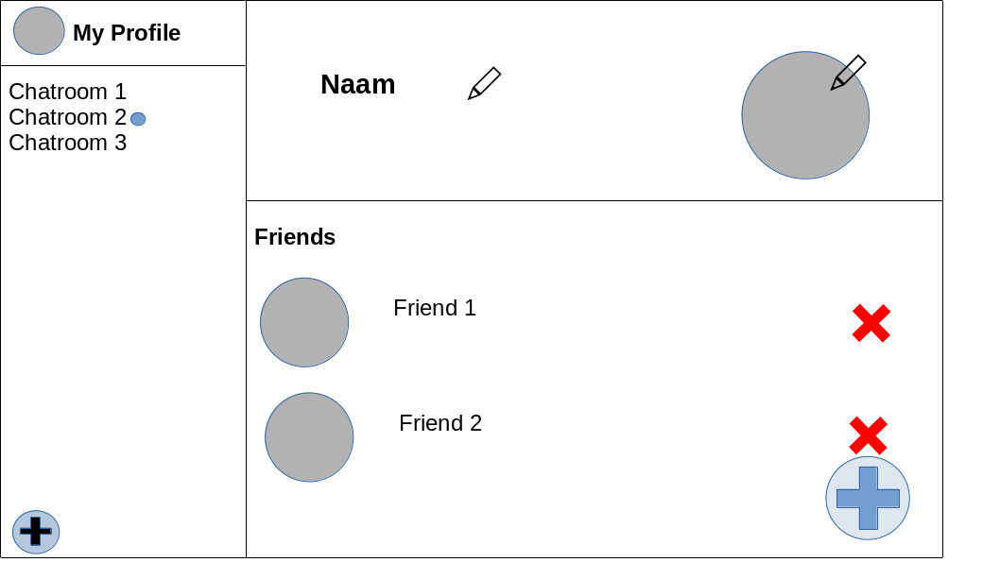
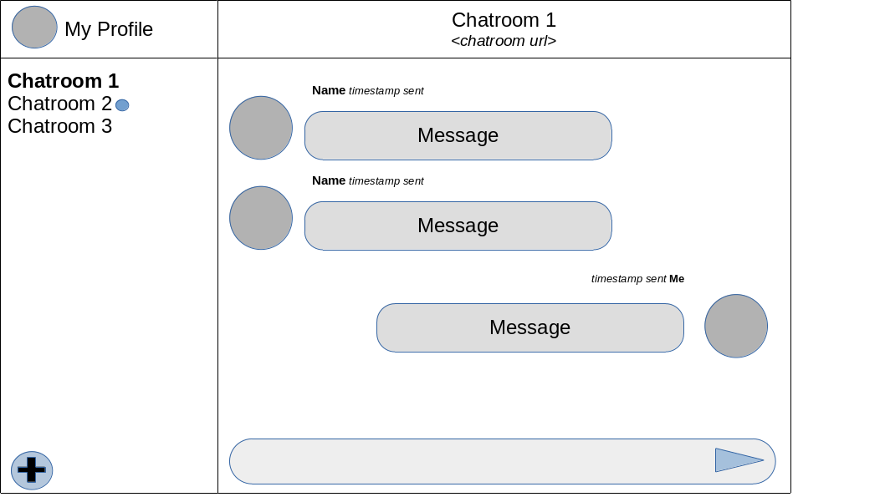
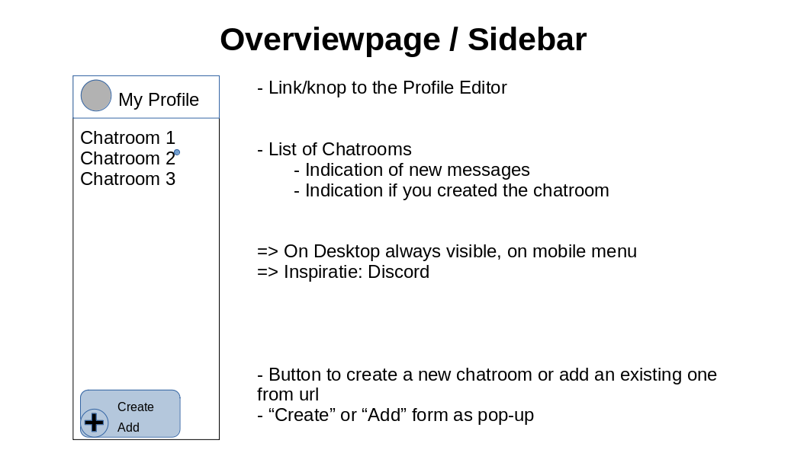
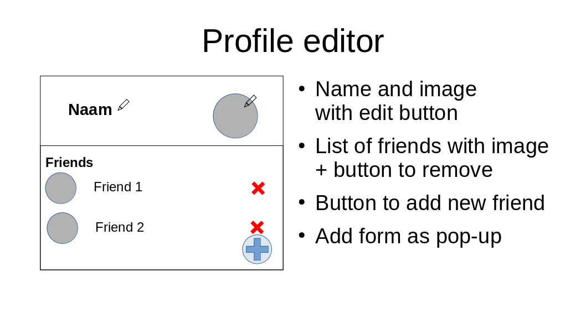
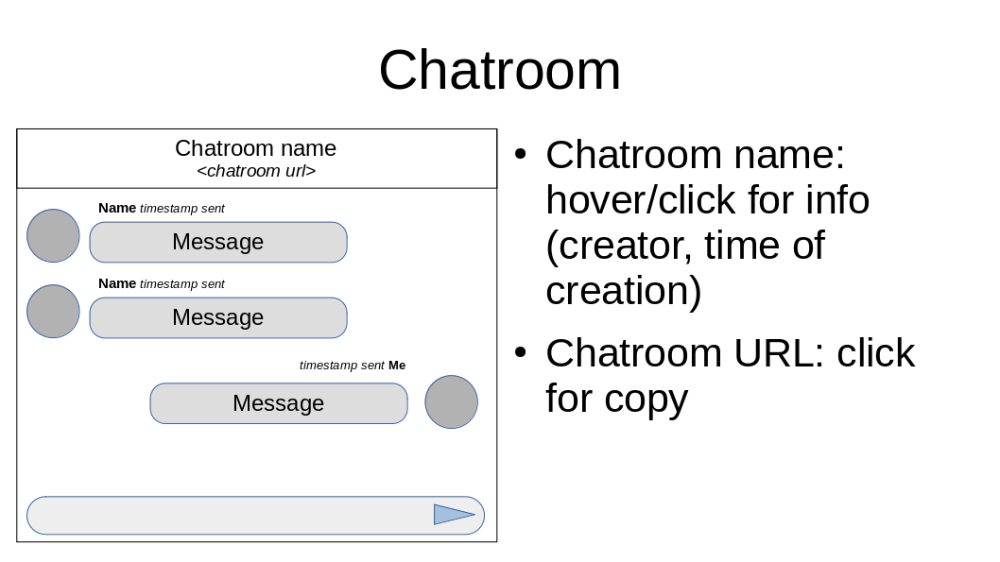

# Decentralized Chat App

## Mockups

### Full

### Overview page / sidebar

### Profile Editor page

### Chatroom page

## Needed Components

### Image

Gets an image `src` url and an optional `size` (default=100px) as props and displays that image in a circle.

### Friend

Gets the WebID/url from a person and displays an [Image](#image) and his name. Option to also display remove button that when clicked emits a remove event or does the deleting self.

### NewButton

Rounded button with a plus sign. When clicked fires the onClick event (usually opens a [Form pop-up](#form)), or expands to a box with multiple add options that got passed on with a slot.

### Form

A form pop-up that has the form elements in a slot, and fires an event on submit or handles the submit itself.

### ChatMessage

Gets a message url as prop. Displays the author with [Image](#image) and name and creation date. And displays the message content.

### Editable

Gets passed a resource and HTML tag or component name. This can be a name and a h2 tag, or a image URL and an [Image component](#image). Displays it with a [edit button](/src/assets/pencil.png). Allows editing and emits when it is edited. See also [v-model](https://vuejs.org/guide/essentials/forms.html) and [components with v-model](https://vuejs.org/guide/components/events.html#usage-with-v-model).

### Overview

Gets passed an imageurl and a list of chatroom urls as props. Displays the [Overview](#overview-page--sidebar).
The chatrooms is a list of links linking to the requested [Chatroom](#chatroom) in the application. 
The "My Profile" is a link to the [Profile Editor](#profile-editor) page in the application.
The [New Button](#newbutton) has two options, one to create a chatroom and one to add a chatroom from a url. Both open a [Form](#form) pop-up requesting the needed info.

### Profile Editor

Gets passed whatever the current logged in user is identified with as a prop. Displays the [Profile Editor](#profile-editor-page).
The "Name" and "Image" are [Editables](#editable).
The "Friends" is a list of [Friends](#friend).
The [New Button](#newbutton) only has the option to add a new friend from his/her WebID. It opens a [Form pop-up](#form) for this.

### Chatroom

Gets passed the chatroom URL as a prop. Displays the [Chatroom](#chatroom-page).
The chatroom name shows info when clicked or hovered over. See title attribuut or costum pop-up.
The chatroom url gets copied when clicked on.
The messages are [ChatMessages](#chatmessage) and gets displayed chronologically. This will have an y-overflow scroll and be all the way scrolled down.
The new chatmessage "form" can be a ChatInput component if it gets too complex.
